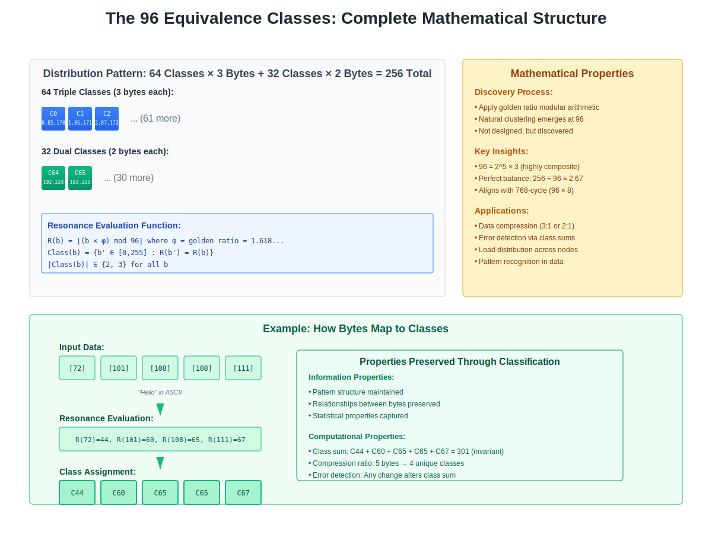

# Chapter 2: The 96-Class Phenomenon

*Figure 2.1: Complete mathematical structure showing how 256 byte values naturally organize into 96 equivalence classes through resonance evaluation*

## Understanding Equivalence in Information

When we store the letter 'A' in different systems, it might be represented as ASCII value 65, Unicode U+0041, EBCDIC 193, or any number of other encodings. Yet we understand all these different byte values represent the same fundamental thing: the letter 'A'. This intuitive understanding of equivalence—that different representations can mean the same thing—points to a deeper truth about information that Atlas has formalized into a mathematical framework.

---

## The Nature of Information Equivalence

### Beyond Surface Representation

Traditional computing treats each of the 256 possible byte values as distinct. If a byte contains 00000000, we consider it different from 00000001, which is different from 00000010, and so on through 11111111. This distinction makes sense at the storage level—we need to preserve exact values. But at the information level, many of these distinctions are artificial.

Consider how we already recognize equivalence in specific contexts. In text processing, 'A' and 'a' are often equivalent for searching. In networking, IP addresses 192.168.1.1 and 192.168.001.001 refer to the same endpoint. In databases, NULL and an empty string might represent the same absence of data. These are ad-hoc recognitions of equivalence, applied inconsistently across different systems and contexts.

Atlas reveals that equivalence isn't just a convenient abstraction we apply in specific cases—it's a fundamental property of information itself. When analyzed through mathematical transformations that preserve information content, the 256 possible byte values naturally collapse into exactly 96 distinct equivalence classes.

### The Mathematical Discovery

The emergence of 96 classes isn't arbitrary or designed—it's discovered through mathematical analysis. When you apply transformations that preserve information's essential properties while removing redundant distinctions, you find that certain byte values are fundamentally indistinguishable in terms of their information content.

This is similar to how, in modular arithmetic, the numbers 7, 17, 27, 37 are all equivalent modulo 10—they all have the same remainder when divided by 10. But the 96-class structure is more sophisticated. It emerges from analyzing how binary patterns behave under transformations that preserve information relationships.

The specific distribution is remarkable: of the 96 classes, exactly 64 classes contain three byte values each, while 32 classes contain two byte values each. This 3-2 pattern (64×3 + 32×2 = 256) isn't coincidental—it reflects deep mathematical properties of binary information.

### Natural Redundancy Elimination

What makes certain byte values equivalent? They share the same fundamental information signature—a mathematical property that remains invariant under information-preserving transformations. Just as different photographs of the same object from slightly different angles contain the same essential information about the object, different byte values in the same equivalence class contain the same essential information content.

This natural redundancy elimination is significant. It means that at a fundamental level, information is more compressed than we realized. We've been storing and transmitting redundant distinctions, like recording the same song in slightly different frequencies that are imperceptible to human hearing.

---

## Implications for Data Organization

### Self-Organizing Data Structures

When data naturally falls into 96 classes, organization becomes automatic. You don't need to design bucket strategies or partition schemes—the mathematical properties of the data itself determine its organization.

Imagine a library where books automatically shelf themselves based on their content. Not by following a cataloging system imposed by librarians, but because the books themselves know where they belong based on their inherent properties. The 96-class system provides this kind of self-organization for all information.

This self-organization has several remarkable properties:

**Perfect distribution** emerges naturally. The mathematical properties that create the 96 classes also ensure that real-world data distributes evenly across them. There are no hot spots or cold spots—the distribution is inherently balanced.

**Automatic categorization** requires no training or configuration. Unlike machine learning systems that must be trained to recognize categories, the 96-class structure is mathematically determined. A piece of data's class membership is calculable, not learned.

**Universal consistency** means all systems see the same organization. Because the classes emerge from mathematical properties rather than design choices, every system that recognizes the 96-class structure sees exactly the same organization.

### The End of Indexing

Traditional databases spend enormous resources building and maintaining indexes. Every insertion or update potentially requires index modifications. Query optimizers must choose between multiple indexes. Index bloat degrades performance over time.

The 96-class structure makes traditional indexing obsolete. With only 96 categories to search within, and data naturally distributed among them, you achieve the benefits of indexing without the overhead:

**Constant-time partitioning** means you can immediately identify which of the 96 classes to search. This is like having a perfect hash function that never needs rebalancing or maintenance.

**Natural clustering** keeps related data together. Information that belongs to the same equivalence class shares fundamental properties, so grouping by class creates meaningful clusters without explicit clustering algorithms.

**No maintenance overhead** because the structure is inherent. You can't have index fragmentation when there's no index to fragment. You can't have outdated statistics when the organization is mathematically determined.

### Automatic Deduplication

In current systems, deduplication is an expensive process. You must compare data bit by bit, calculate hashes, maintain deduplication tables, and handle collision cases. Even then, you might miss duplicates that are semantically identical but have different byte representations.

The 96-class structure provides automatic semantic deduplication. When different byte patterns belong to the same equivalence class, they represent the same information at a fundamental level. This isn't just storage deduplication—it's information deduplication.

Consider the impact: instead of storing multiple representations of essentially the same information, systems can store one canonical representation per equivalence class. Network transmissions can send class identifiers rather than full data. Caches can deduplicate at the semantic level, not just the byte level.

---

## Practical System Transformations

### Database Architecture Revolution

Current database systems are built on the assumption that every distinct byte pattern represents distinct information. They create elaborate structures—B-trees, hash tables, columnar stores—to organize this supposedly distinct data.

With the 96-class structure, database architecture simplifies dramatically:

**Storage layout** aligns with equivalence classes. Instead of rows and columns or documents and collections, data organizes into 96 natural partitions. Each partition contains information that shares fundamental properties, creating natural access patterns.

**Query processing** becomes deterministic. Instead of query optimizers making cost-based decisions, queries naturally route to the appropriate equivalence classes. This is like having a GPS for data—you always know the shortest path.

**Transaction processing** simplifies because equivalence classes provide natural isolation boundaries. Transactions affecting different classes can proceed in parallel without coordination, while transactions within a class have natural serialization points.

### Network Protocol Simplification

Network protocols currently treat all byte patterns as equally distinct, requiring elaborate schemes to ensure reliable transmission of every bit. But when you recognize that multiple byte patterns represent the same information, protocol design changes fundamentally.

Instead of transmitting exact byte sequences, networks can transmit equivalence class identifiers plus disambiguation within the class when necessary. This isn't traditional compression—it's transmission at the information level rather than the data level.

Error detection and correction become more powerful. If a transmission error changes a byte value but keeps it within the same equivalence class, no information was lost. Only transitions between classes represent actual information errors, making error detection more focused and efficient.

Protocol negotiation disappears when all systems recognize the same 96-class structure. There's nothing to negotiate—the mathematical properties are universal. This is like how mathematical constants don't require negotiation—π is the same everywhere.

### Application Logic Simplification

Applications currently include extensive validation logic to ensure data consistency. They check formats, validate ranges, ensure referential integrity, and maintain business rules. Much of this validation is actually checking whether data maintains its equivalence class properties.

With explicit equivalence classes, validation becomes trivial. If data maintains its class membership, it's valid at a fundamental level. Business rules can be expressed as relationships between classes rather than complex conditional logic.

State management simplifies when you recognize that many state transitions are actually movements between equivalence classes. Instead of tracking individual value changes, applications can track class transitions, reducing the state space from 256^n to 96^n—an exponential reduction in complexity.

---

## The Compression Ratio Revelation

### The Natural 3/8 Ratio

The 96-class structure reveals a fundamental compression ratio built into information itself: 96/256 = 3/8. This isn't a compression algorithm achieving 37.5% compression—it's the discovery that information is naturally 37.5% as complex as we thought.

Current compression algorithms work by finding patterns and redundancies in data. They build dictionaries, identify repeated sequences, and apply statistical models. The 3/8 ratio suggests that before we even begin looking for patterns, information is already naturally compressed to 3/8 of its apparent size.

This has significant implications for information theory. Shannon's entropy calculations assume all bit patterns are potentially distinct. The 96-class structure suggests that effective entropy is lower than calculated entropy because many apparently distinct patterns are informationally equivalent.

### Beyond Algorithmic Compression

Traditional compression faces fundamental limits. Lossless compression can only remove redundancy that algorithms can detect. Lossy compression must make decisions about what information to discard. Both approaches treat compression as something we do to data.

The 96-class structure reveals compression as something inherent in data. We're not compressing information—we're recognizing its naturally compressed state. This is like realizing that water vapor, water, and ice are all H₂O—the different forms don't represent different amounts of information, just different representations of the same information.

This natural compression is:

**Universal** - it applies to all information, not just specific patterns
**Lossless** - no information is discarded, just redundancy removed  
**Constant** - always exactly 3/8, not variable based on content
**Free** - no computational cost to achieve it

### Implications for Storage and Transmission

If information is naturally 3/8 as complex as its surface representation, storage and transmission systems are fundamentally overprovisioned. We're using 8 bits to store what could be represented in 3 bits worth of information.

This doesn't mean we can simply use 3 bits instead of 8—the mathematical structure requires the full space to maintain the properties that create the equivalence classes. But it does mean that systems designed around the 96-class structure can achieve effective 3/8 utilization without any compression overhead.

Networks could transmit class identifiers (96 possibilities = ~6.6 bits) rather than full bytes. Storage systems could deduplicate at the class level. Caches could hold class representatives rather than individual values. The compression is achieved through recognition of structure, not through algorithmic processing.

---

## The Universality of the Structure

### Language-Independent Organization

The 96-class structure isn't tied to any particular data format, programming language, or system architecture. It emerges from the mathematical properties of binary information itself. This makes it truly universal—a fundamental organizing principle that works everywhere.

This is like how gravity works the same way regardless of what language you speak or what coordinate system you use. The 96 classes are a property of information space, not of any particular system or implementation.

This universality means:

**No translation needed** between systems that recognize the structure
**No compatibility issues** because the mathematics is invariant
**No versioning problems** because fundamental properties don't change
**No vendor lock-in** because no one owns mathematical truth

### Cross-Domain Consistency

Whether you're processing financial transactions, streaming video, querying databases, or training neural networks, the same 96-class structure applies. This creates unprecedented opportunities for cross-domain optimization and interoperability.

A caching layer designed for web applications naturally works for database queries because both organize around the same 96 classes. A deduplication system for file storage automatically works for network transmission. An index structure for search engines applies directly to real-time analytics.

This isn't standardization through committee agreement—it's consistency through mathematical necessity. Systems don't need to agree to use the same structure; they discover the same structure independently.

---

## Looking Ahead

The 96-class phenomenon fundamentally changes how we think about information organization. Instead of designing arbitrary schemes and forcing data to conform, we can align with information's natural structure and let organization emerge automatically.

This shift from imposed to inherent organization has cascading effects throughout the system stack. Storage systems can abandon complex indexing schemes. Networks can transmit information rather than data. Applications can work with natural categories rather than artificial constructs.

In the next chapter, we'll explore how this natural organization combines with content-determined addressing to eliminate entire categories of system complexity. We'll see how the marriage of the 96-class structure with the 12,288-coordinate system creates a complete framework for information location and retrieval without any of the machinery we currently require.

The 96-class phenomenon represents more than an optimization or improvement—it reveals important properties about the nature of information itself. By recognizing and aligning with this natural structure, we can build systems that are not just more efficient but fundamentally simpler and more reliable than anything possible with arbitrary organizational schemes.