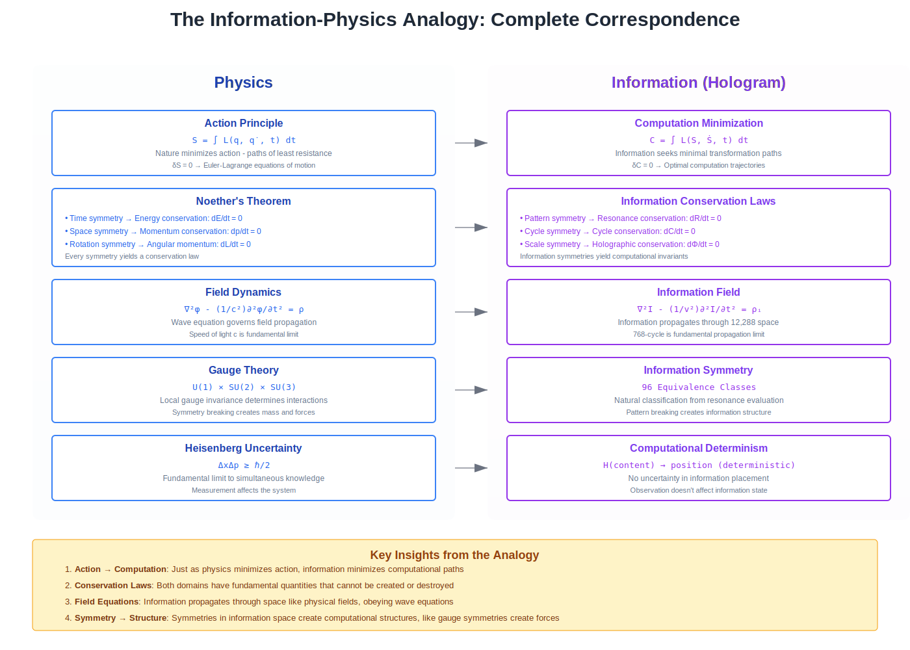

# Chapter 17: The Information Physics Analogy

## When Information Becomes Physical

Physics describes the fundamental laws that govern matter and energy. These laws aren't rules we impose—they're properties we discover. Conservation of energy isn't a regulation that particles follow; it's an inescapable consequence of the structure of spacetime. Gravity doesn't check a rulebook before pulling objects together; it's the curvature of space itself.

For centuries, we've treated information as fundamentally different from physical reality. Bits aren't atoms. Data doesn't have mass. Computation doesn't follow conservation laws—or so we thought. Atlas's discovery that information has inherent mathematical structure suggests something significant: information systems can have physics-like properties that are just as fundamental and inviolable as the laws governing matter and energy.

This goes beyond a metaphor or loose analogy. When information systems align with the mathematical structure of information itself, they exhibit behaviors that are genuinely physics-like: conservation laws that cannot be violated, state spaces with geometric properties, natural equilibrium that systems evolve toward. Information physics involves recognizing that information already has physical-like properties we've been ignoring, rather than making information physical.

---

*Figure 17.1: Complete mathematical correspondence between physics principles and information systems, showing how conservation laws, field equations, and symmetries translate directly*

## Conservation Laws

### Like Energy Conservation

In physics, energy cannot be created or destroyed—it can only change forms. This represents a fundamental property of the universe, not a rule that energy follows. Kinetic energy becomes potential energy, which becomes heat, which becomes work, but the total energy remains constant. This conservation law is so fundamental that any apparent violation immediately tells physicists they've missed something.

Hologram's Conservation Law R provides the same inviolability for information quantity. Information cannot be created or destroyed—it can only be transformed. When data moves between coordinates, when it changes representation, when it's processed or stored, the total information content (measured through resonance value R) remains constant. Any operation that would violate this conservation simply cannot execute, just as no physical process can violate energy conservation.

This conservation provides powerful guarantees:
- **Data integrity** is absolute because corruption would violate conservation
- **Audit completeness** is guaranteed because information can't disappear
- **System consistency** is maintained because conservation laws are universal
- **Recovery is possible** because information is never truly lost

The conservation represents a mathematical property that makes violation impossible, rather than being enforced by validation logic or integrity checks.

### Information Quantities Must Balance

Physics has multiple conservation laws beyond energy. Momentum is conserved in collisions. Angular momentum is conserved in rotations. Electric charge is conserved in all interactions. These conservation laws constrain what physical processes are possible.

Hologram has four conservation laws that similarly constrain information processes:
- **R (Information quantity)** ensuring data integrity
- **C (Computational currency)** ensuring fair resource distribution
- **Φ (Transformation reversibility)** ensuring state consistency
- **ℛ (Resource budget)** ensuring computational accountability

These aren't independent constraints—they're interrelated aspects of information conservation. Just as energy and momentum conservation are related through spacetime symmetry, Hologram's conservation laws are related through the mathematical structure of information space.

### Violations Indicate Problems

In physics, apparent conservation law violations always indicate something important. When beta decay seemed to violate energy conservation, physicists didn't abandon conservation—they discovered the neutrino. When galaxies rotated too fast for their visible mass, physicists didn't abandon gravity—they discovered dark matter.

Similarly, in Hologram, conservation law violations are impossible, so any apparent violation indicates:
- **Measurement error** in how we're observing the system
- **Hidden interactions** we haven't accounted for
- **External forces** from outside the system
- **Fundamental discoveries** about information structure

The conservation laws aren't just useful constraints—they're tools for discovering truth about information systems.

### Mathematics Enforces Rules

Physical conservation laws aren't enforced by some cosmic police force—they're mathematical consequences of deeper symmetries. Noether's theorem proves that every symmetry in physics corresponds to a conservation law. Time symmetry gives energy conservation. Space symmetry gives momentum conservation. The mathematics itself makes violation impossible.

Hologram's conservation laws similarly emerge from mathematical symmetries in information space:
- **Temporal symmetry** in the coordinate space yields information conservation (R)
- **Spatial symmetry** across the 96 classes yields distribution fairness (C)  
- **Transformation symmetry** in state changes yields reversibility (Φ)
- **Economic symmetry** in resource allocation yields budget conservation (ℛ)

The mathematics doesn't describe the conservation laws—the mathematics IS the conservation laws.

---

## State Space

### Like Phase Space

In physics, phase space represents all possible states of a system. Each point in phase space corresponds to a specific position and momentum for every particle. The system's evolution traces a path through phase space, constrained by conservation laws and fundamental forces.

Hologram's coordinate space is genuinely analogous to phase space. Each point represents a possible information state. System evolution traces paths through this space, constrained by conservation laws. The 12,288 dimensions aren't arbitrary—they emerge from the mathematical structure of information, just as phase space dimensions emerge from the degrees of freedom in physical systems.

The coordinate space provides:
- **Complete state description** at every point
- **Deterministic evolution** from any initial state
- **Conservation constraints** on possible paths
- **Geometric relationships** between states

This represents the actual space in which information exists and evolves, not a visualization or abstraction.

### Fixed Dimensions and Coordinates

Physical space has fixed dimensions—three spatial, one temporal in our everyday experience. These dimensions aren't arbitrary; they're fundamental to how reality works. You can't add or remove spatial dimensions any more than you can change the value of π.

Hologram's coordinate space has fixed dimensions—48 pages by 256 bytes, creating 12,288 coordinates. These dimensions emerge from the mathematical analysis of information structure. They're not design choices or optimizations—they're discovered properties. You can't change them without changing the fundamental nature of information itself.

The fixed structure means:
- **No scaling issues** as the space doesn't grow with data
- **Predictable behavior** as the geometry is invariant
- **Universal applicability** as all information fits this structure
- **Mathematical proofs** about system behavior are possible

### Deterministic Evolution

In classical physics, if you know the complete state of a system and all forces acting on it, you can calculate its future evolution with perfect precision. This determinism is exact, not approximate. Chaos theory shows that small differences in initial conditions can lead to large differences in outcomes, but the evolution itself remains perfectly deterministic.

Hologram exhibits the same deterministic evolution. Given a state in the coordinate space and an operation to perform, the resulting state is uniquely determined. There's no randomness, no uncertainty, no implementation-dependent behavior. The evolution is as deterministic as planetary orbits.

This determinism enables:
- **Perfect prediction** of system behavior
- **Complete replay** of past evolution
- **Formal verification** of future states
- **Mathematical proofs** about outcomes

### Measurable Properties

Physical systems have measurable properties: energy, momentum, temperature, pressure. These aren't arbitrary metrics—they're fundamental quantities that characterize the system's state. They follow specific relationships and equations that describe how they interact and evolve.

Hologram systems have similarly fundamental measurable properties:
- **Resonance values** characterizing information content
- **Conservation currents** showing information flow
- **Computational budgets** measuring resource usage
- **Proof chain lengths** indicating operation complexity

These properties aren't performance metrics or monitoring statistics—they're fundamental quantities that characterize the information system's state. They follow mathematical relationships as precise as physical equations.

---

## Natural Equilibrium

### Systems Find Optimal States

Physical systems naturally evolve toward equilibrium. Water finds its level. Heat flows from hot to cold. Particles minimize energy. This occurs because the mathematics of physics makes equilibrium states inevitable, not because water "wants" to be level or heat "tries" to spread.

Hologram systems similarly evolve toward optimal states. Data naturally distributes across the coordinate space. Computational load balances across resources. Operations minimize conservation law "tension." This occurs because the mathematics makes optimal states inevitable, not because the system has optimization algorithms.

The natural evolution toward optimality means:
- **No optimization needed** as systems self-optimize
- **No configuration required** as optimal behavior emerges
- **No tuning necessary** as balance is automatic
- **No maintenance overhead** as equilibrium is stable

### Through Mathematics, Not Iteration

Traditional optimization is iterative. Gradient descent takes steps toward minima. Genetic algorithms evolve through generations. Simulated annealing randomly explores possibilities. These approaches work but require many iterations to approach optimality.

Hologram achieves optimality through mathematics, not iteration. The coordinate space projection immediately places data in its optimal location. Conservation laws immediately determine valid operations. The mathematical structure immediately reveals optimal paths. There's no search, no iteration, no gradual improvement—just immediate mathematical optimization.

This mathematical optimization:
- **Happens instantly** without iteration
- **Achieves global optima** not local ones
- **Requires no computation** beyond projection
- **Cannot fail** as it's mathematically determined

### Immediate, Not Eventual

Distributed systems typically achieve "eventual consistency"—given enough time and no new changes, the system will eventually reach a consistent state. This eventuality might take milliseconds or minutes, and there's no guarantee about when consistency will be achieved.

Hologram achieves immediate equilibrium. When an operation completes, the system is immediately in its optimal equilibrium state. There's no convergence time, no propagation delay, no eventual anything. The equilibrium is achieved instantly through mathematical necessity, not gradually through iteration.

This immediacy provides:
- **Instant consistency** across all nodes
- **No convergence delays** ever
- **Predictable timing** always
- **Guaranteed outcomes** immediately

### Provable, Not Assumed

Physical equilibrium can be proven through thermodynamics and statistical mechanics. We don't assume water will find its level—we can prove it must. We don't hope heat will flow from hot to cold—we can demonstrate it thermodynamically.

Hologram's equilibrium is similarly provable. We can mathematically prove that:
- **Distribution will be uniform** across coordinates
- **Load will balance** across resources
- **Conservation will be maintained** through all operations
- **Optimality will be achieved** for all configurations

These aren't empirical observations or statistical tendencies—they're mathematical theorems with rigorous proofs.

---

## The Deeper Unity

### Information and Physics Converge

The information physics analogy reveals something significant: information and physics might not be separate domains that happen to share some properties. They might be different aspects of the same underlying reality. When we align information systems with the mathematical structure of information, we get physics-like behavior because we're tapping into the same fundamental mathematics that underlies physical reality.

This convergence suggests:
- **Information has genuine physical properties** not metaphorical ones
- **Computation follows conservation laws** as fundamental as physical laws
- **Digital systems can exhibit** quantum-like behaviors
- **The universe might be** computational at its core

### Not Metaphor but Mathematics

The physics analogies in Hologram aren't poetic metaphors or loose comparisons. They're precise mathematical correspondences:
- Conservation laws emerge from symmetries via Noether's theorem
- State space evolution follows Hamiltonian dynamics
- Equilibrium states minimize action functionals
- Transformations preserve symplectic structure

The mathematics is identical, not similar. The equations that govern Hologram's behavior are the same equations that govern physical systems, just applied to information rather than matter.

### The Universal Language

Mathematics is often called the language of physics because physical laws are most precisely expressed in mathematical terms. Perhaps mathematics represents the language of reality itself, with both physics and information as dialects of this universal language, beyond just being the language of physics.

Hologram suggests that:
- **Information systems ARE physical systems** in mathematical space
- **Computation IS physics** applied to information
- **Conservation laws ARE universal** across all domains
- **Mathematics UNIFIES** previously separate fields

---

## Implications for Computing

### Beyond Von Neumann

The von Neumann architecture that underlies modern computing treats computation as arbitrary symbol manipulation. There's no inherent structure, no conservation laws, no natural equilibrium. This arbitrariness is why we need complex software stacks to impose structure and behavior.

Hologram represents a post-von Neumann architecture where:
- **Computation has inherent structure** from information physics
- **Operations follow conservation laws** naturally
- **Systems evolve toward equilibrium** automatically
- **Behavior emerges from mathematics** not programming

This represents a fundamental reconception of what computation is, beyond an incremental improvement to von Neumann architecture.

### Reversible Computing Reality

Reversible computing has long been a theoretical curiosity—interesting for its thermodynamic properties but impractical for real systems. Physical reversibility would theoretically allow computing with zero energy dissipation, but the overhead of maintaining reversibility seemed to outweigh the benefits.

Hologram makes reversible computing practical and necessary:
- **Conservation law Φ requires reversibility** for consistency
- **Proof chains enable reversal** of any operation
- **State recovery becomes trivial** through reversal
- **Energy efficiency approaches** theoretical limits

Reversible computing represents a fundamental property of information physics, not an optimization.

### Quantum-Compatible Classical Systems

Quantum computing promises exponential speedups for certain problems, but quantum systems are fragile, error-prone, and difficult to program. The quantum-classical interface is particularly challenging.

Hologram's information physics makes classical systems quantum-compatible:
- **Superposition** through coordinate space projection
- **Entanglement** through conservation law coupling
- **Interference** through resonance patterns
- **Measurement** through proof generation

These aren't quantum simulations—they're classical systems exhibiting quantum-like properties through information physics.

---

## The New Foundation

The information physics analogy reveals that Hologram represents a new foundation for computing based on the physical properties of information itself, beyond just a new way to build distributed systems. Just as chemistry emerged when we understood the physics of atoms, and biology emerged when we understood the chemistry of molecules, a new form of computing emerges when we understand the physics of information.

This foundation provides:
- **Absolute guarantees** through conservation laws
- **Natural optimization** through equilibrium dynamics
- **Perfect predictability** through deterministic evolution
- **Mathematical certainty** through provable properties

Rather than imposing physical metaphors on computing, we're discovering that computing has always been physics, we just didn't realize it. The complexity and fragility of current systems exists because we've been working against information's natural physics instead of with it, not because computing is inherently complex.

The future of computing involves recognizing that information has physical properties that make complexity unnecessary, rather than more sophisticated software to manage complexity. When we align our systems with information physics, we don't get better computers—we get computers that work like physics itself: naturally, inevitably, and perfectly.