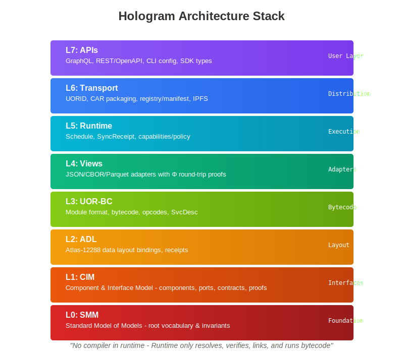

# Chapter 6: The Fixed-Size Global Computer

## The End of Infinite Scaling

Every distributed system today is built on the assumption of growth. You start with a few servers and add more as demand increases. You begin with gigabytes of storage and expand to petabytes. You handle thousands of requests and scale to millions. This growth requires constant management—capacity planning, resource provisioning, scaling strategies, and eventually, painful migrations when you outgrow your architecture.

The fixed-size global computer inverts this assumption. Instead of a system that grows, Atlas provides exactly 12,288 computational coordinates that never increase or decrease. The fixed size is a fundamental reconception of computational resources and their utilization. Like the constant speed of light enables relativity, the fixed size enables capabilities impossible in growing systems.

---

## Understanding the 12,288 Structure

*Figure 6.1: The Hologram architecture stack from foundation to APIs*

### Why This Specific Number

The number 12,288 isn't arbitrary—it emerges from mathematical analysis as the minimum size for a complete computational space. It factors as 2^12 × 3, or more naturally as 48 × 256, creating a two-dimensional structure that perfectly balances several competing requirements.

At 48 × 256, the structure provides:
- Enough coordinates for complete addressing of all possible information states
- Natural alignment with binary operations (256 = 2^8)
- Perfect factorization for distributed processing (48 = 16 × 3)
- Optimal size for proof verification (small enough to verify, large enough to be complete)

Smaller structures lack completeness—they can't represent all necessary states. Larger structures add redundancy without additional capability. 12,288 is the "Goldilocks" size—just right for complete computation.

The periodic table has a specific number of stable elements determined by physical constraints. You cannot create additional elements for chemistry. Similarly, 12,288 emerges from fundamental information constraints.

### The Matrix Organization

The 48 × 256 matrix isn't just a convenient visualization—it represents two fundamental dimensions of computation. The 48 rows represent what we might think of as "spatial" organization—broad domains or categories of computation. The 256 columns represent "temporal" organization—fine-grained states within domains.

Every computational task naturally maps to a region of this matrix:
- Database operations might primarily use rows 0-11
- Network protocols might operate in rows 12-23
- User interfaces might occupy rows 24-35
- Analytics might utilize rows 36-47

These represent natural clustering based on mathematical properties rather than fixed assignments. Related computations naturally map to nearby coordinates, creating locality without explicit organization.

Within each row, the 256 columns provide the state space for computation. This is enough to represent any possible state—remember that the 96 equivalence classes mean we're really working with 96^3 possible states per row, which equals over 880,000 distinct states. Multiply by 48 rows, and you have over 42 million possible global states—more than enough for any computational task.

### Fixed Size as a Feature

The fixed size enables the system's most powerful capabilities. Consider what the fixed size provides:

**Deterministic addressing** is possible because the address space never changes. Coordinate (23, 147) always refers to the same computational location. You never need to recalculate addresses due to growth.

**Complete verification** becomes feasible because you can verify the entire system state. With only 12,288 coordinates, complete system verification takes milliseconds, not hours.

**Perfect load distribution** emerges because you know exactly how many resources exist. You can mathematically guarantee even distribution across a known, fixed space.

**Predictable performance** follows from fixed resources. Performance doesn't degrade as the system grows because the system doesn't grow. Day one performance equals year ten performance.

---

## How Fixed Size Handles Infinite Demand

### The Projection Principle

The key to handling unlimited demand with fixed resources lies in the projection principle. All computational tasks, regardless of their apparent size, project onto the 12,288 coordinates. This recognizes that all computation fundamentally involves transformations in this finite space.

Think of it like a piano with 88 keys. You can play an infinite number of songs, from simple melodies to complex symphonies, all using the same 88 keys. The keys don't increase when you play more complex music—you utilize them differently. Similarly, the 12,288 coordinates can handle any computational task through different utilization patterns.

When a large dataset needs processing:
1. It projects onto the coordinates based on its mathematical properties
2. Processing occurs at those coordinates
3. Results project back to the requesting context
4. The coordinates are immediately available for the next task

Coordinates are utilized temporarily and then available for reuse, similar to CPU registers. This is like how a CPU's registers don't get consumed by calculations—they're used and reused millions of times per second.

### Temporal Multiplexing

While the spatial structure is fixed at 12,288 coordinates, temporal multiplexing provides unlimited capacity. Each coordinate can handle different computations at different times, with the conservation laws ensuring fair access and preventing monopolization.

The 768-cycle conservation law ensures that every coordinate gets utilized exactly once in each phase of the cycle. This creates natural time-slicing:
- Phase 1 (steps 0-255): First pass through all coordinates
- Phase 2 (steps 256-511): Second pass with different access pattern
- Phase 3 (steps 512-767): Third pass completing the cycle

This temporal multiplexing means that while you have 12,288 coordinates at any instant, over a complete cycle you have 12,288 × 768 = 9,437,184 computational slots. The system processes nearly 10 million operations per cycle while maintaining perfect fairness and conservation.

### Natural Queueing

When demand exceeds instantaneous capacity, natural queueing occurs. But unlike traditional queues that require management and can grow unbounded, these queues are mathematically bounded by the cycle structure.

A computation that can't execute immediately because its coordinates are in use simply waits for the next available cycle slot. The maximum wait time is one complete cycle (768 steps), and the average wait time is half that. This provides predictable, bounded latency for all operations.

The queueing is also fair by mathematical necessity. The conservation laws prevent any computation from monopolizing coordinates, ensuring all queued operations get their fair share of resources. You can't have starvation because the mathematics requires every coordinate to be available regularly.

---

## Global State Coherence

### Single System Image

Despite being distributed across potentially thousands of physical nodes, the 12,288 coordinates provide a single, coherent system image. Every node sees the same coordinate space, the same state transitions, and the same conservation laws.

This is different from current distributed systems where each node has its own view and complex protocols try to synchronize views. In the fixed-size global computer, there's only one view—the mathematically determined state of the 12,288 coordinates.

Achieving this coherence doesn't require consensus protocols or synchronization mechanisms. The conservation laws ensure that all nodes must agree on state because only states that preserve conservation are valid. Nodes can't diverge because divergence would violate conservation.

### Instantaneous Global Updates

When state changes at any coordinate, mathematical necessity makes the change globally visible instantly. If coordinate (15, 231) transitions from state A to state B, every node calculating that coordinate's state will compute B.

Changes are mathematically determined, providing immediate consistency rather than eventual consistency that propagates over time. The "propagation" is the speed of computation, not communication.

This enables:
**Global transactions** without coordination overhead
**Instant cache coherence** without invalidation protocols
**Consistent reads** without read locks or timestamps
**Atomic operations** without compare-and-swap primitives

### Partition Tolerance Through Mathematics

Network partitions—where parts of the system can't communicate—are catastrophic for traditional distributed systems. They must choose between consistency and availability (the CAP theorem), leading to complex partition-handling strategies.

The fixed-size global computer is naturally partition-tolerant through mathematics. Even if nodes can't communicate, they can still compute the same states because the states are mathematically determined. When partitions heal, nodes are automatically consistent because they've been computing the same mathematical transformations.

Nodes maintain continuous consistency despite partitions, not eventual consistency after healing. The mathematics ensures nodes stay synchronized even when they can't communicate.

---

## Resource Utilization

### Perfect Load Distribution

In traditional systems, load distribution is a constant challenge. Hot spots develop where some servers are overloaded while others sit idle. Load balancers try to distribute work evenly but can only approximate good distribution.

The fixed-size structure provides perfect load distribution by mathematical necessity. Content naturally projects across all coordinates based on its properties. The mathematics ensures even distribution—hot spots are impossible because content can't cluster at specific coordinates.

This perfect distribution means:
- Every coordinate handles exactly its share of load
- No coordinate can be overloaded
- No coordinate can be underutilized
- No load balancing decisions needed

### Automatic Resource Allocation

Resources don't need to be explicitly allocated to tasks—tasks naturally utilize the resources at their projected coordinates. This is like how water naturally finds its level without explicit allocation decisions.

When a computation needs resources:
1. It projects to its natural coordinates
2. It utilizes resources at those coordinates
3. Conservation laws ensure fair resource usage
4. Resources are automatically available for the next computation

There's no:
- Resource reservation systems
- Allocation algorithms
- Scheduling decisions
- Resource contention

Resources are simply utilized according to mathematical laws, like how objects fall according to gravity without deciding how to fall.

### Optimal Utilization

The fixed size ensures optimal utilization because there are no spare resources to waste. Every coordinate is always either actively computing or immediately available for computation. There's no idle capacity because capacity is fixed and fully utilized.

Like an assembly line where every station is either working or ready, the system has no idle capacity. There's no slack in the system because the system is sized exactly for complete utilization.

Traditional systems struggle with the utilization paradox—you need spare capacity for peaks, but spare capacity means waste during normal operation. The fixed-size global computer resolves this paradox through temporal multiplexing—peak loads use more time slices, not more resources.

---

## Scalability Without Growth

### Handling More Users

When more users join the system, they don't require more coordinates—they share the existing coordinates through temporal multiplexing. Each user's computations project onto the coordinate space and execute in their assigned time slices.

This is like a telephone system where adding users doesn't require adding more phone numbers—users share the same number space without conflict. The mathematics ensures that users can't interfere with each other despite sharing coordinates.

Ten users or ten million users utilize the same 12,288 coordinates. The difference is only in temporal utilization—more users means more time-slicing, not more resources.

### Processing More Data

Large datasets don't require more coordinates—they project onto the existing coordinates differently. A gigabyte of data and a petabyte of data both map to the same 12,288 coordinates, just with different projection patterns.

This works because:
- Data projects based on content, not size
- Similar data projects to similar coordinates
- Processing occurs where data projects
- Results project back to users

The coordinates are like a lens that focuses computation regardless of the size of what's being computed. A magnifying glass doesn't get bigger when you look at bigger objects—it focuses light the same way regardless.

### Supporting More Applications

New applications don't require new coordinates—they utilize existing coordinates in new patterns. Each application's computations naturally project to regions of the coordinate space based on their mathematical properties.

Applications naturally segregate without explicit assignment:
- Different computational patterns project to different regions
- Conservation laws prevent interference
- Natural boundaries emerge from mathematical properties

This is like how different frequencies of light naturally separate through a prism without explicit frequency allocation. The mathematics handles segregation automatically.

---

## Implications for System Design

### No Capacity Planning

Capacity planning disappears because capacity is fixed. You don't plan for growth because there is no growth. You don't provision resources because resources are fixed. You don't worry about scaling because scaling is automatic through temporal multiplexing.

This eliminates:
- Capacity forecasting models
- Resource provisioning procedures
- Scaling strategies
- Growth planning

Instead of planning capacity, you simply utilize the fixed capacity optimally. It's like planning to use a piano—you don't plan to add keys; you plan how to use the existing keys effectively.

### Predictable Performance Forever

Performance remains predictable indefinitely. The system will perform the same on day one as on day 10,000 because the fundamental structure never changes.

This predictability enables:
- True SLA guarantees (not probabilistic promises)
- Accurate cost modeling (resources never change)
- Long-term planning (no architectural migrations)
- Stable operations (no growth-related problems)

### Simplified Architecture

Architecture simplifies dramatically when you don't need to handle growth:
- No sharding strategies because sharding is natural
- No replication factors because replication is mathematical
- No scaling mechanisms because scaling is automatic
- No growth migrations because there's no growth

The architecture becomes purely about utilizing the fixed structure optimally, not about managing growth. This is like the difference between designing an expanding building (complex) versus optimizing use of a fixed building (simple).

---

## Looking Forward

The fixed-size global computer represents a fundamental shift in how we think about computational resources. Instead of infinite growth requiring constant management, we have fixed resources providing infinite capability through mathematical properties.

This shift from growth to optimization, from scaling to utilization, from expansion to projection, changes everything about system design and operation. It eliminates entire categories of problems while enabling capabilities impossible in growing systems.

In the next chapter, we'll explore how schemas compile directly to this computational fabric, transforming from passive descriptions to active computational elements that execute with mathematical precision across the 12,288 coordinates. We'll see how the combination of fixed structure and compiled schemas creates a programming model where correctness is guaranteed by construction.