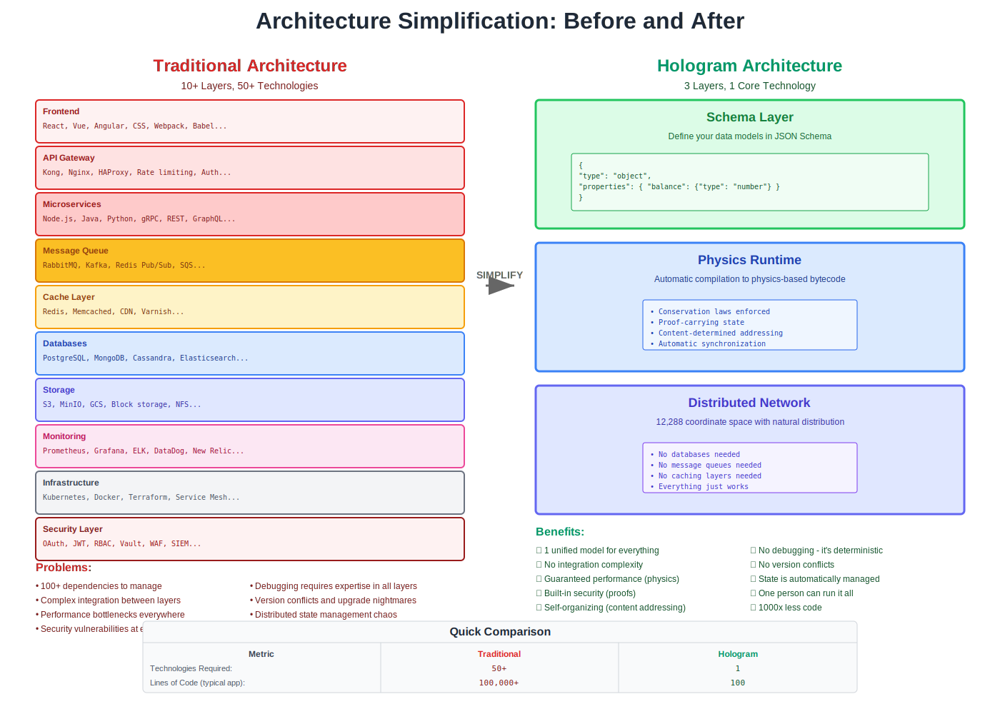

# Chapter 13: Simplified Architecture

*Figure 13.1: Traditional architecture complexity versus Hologram's radical simplification - from 10+ layers to 3*

## The Great Disappearance

Modern software architecture is a testament to complexity. A typical enterprise system involves dozens of components: databases, caches, message queues, API gateways, service meshes, load balancers, monitoring systems, log aggregators. Each component exists to solve problems created by treating information as structureless data. When information's mathematical structure is recognized and utilized, these components don't become better—they become unnecessary.

The approach eliminates complexity rather than hiding it behind interfaces. Entire categories of problems cease to exist. Like inventing the wheel versus improving horseshoes, the change makes previous solutions obsolete through fundamental reconception.

---

## What Disappears

### The Entire Middleware Layer

Middleware exists to mediate between components that cannot directly communicate. Message brokers translate between different protocols. API gateways transform between different interfaces. Service buses route between different services. Enterprise service buses orchestrate complex interaction patterns. Each piece of middleware adds latency, complexity, and failure points.

In Hologram, components don't communicate through messages—they share state through mathematical projection. There's nothing to broker, transform, route, or orchestrate. Components naturally interact through the coordinate space without any mediation. The entire middleware layer—every queue, broker, gateway, and bus—simply disappears.

Middleware exists because we treat information as formless data needing constant translation. When information has natural mathematical structure, components interact directly through that structure without translation or mediation.

### Caching Infrastructure

Caches exist because data access is slow and unpredictable. We cache database queries, API responses, computed results, and static assets. We manage cache hierarchies, invalidation strategies, and consistency protocols. Redis clusters, CDNs, browser caches—layers upon layers of caching infrastructure.

Hologram eliminates caching through deterministic addressing. When data location is calculated rather than looked up, there's no need to cache locations. When access patterns are predictable from mathematical properties, data can be prefetched rather than cached. When operations are reversible, results can be recomputed rather than stored.

The performance benefits we seek from caching are achieved through mathematical properties:
- **Locality** through coordinate space proximity
- **Prediction** through deterministic patterns  
- **Reuse** through proof composition
- **Speed** through direct calculation

Caching infrastructure doesn't become more efficient—it becomes irrelevant.

### Message Brokers and Queues

Message-oriented systems seem fundamental to distributed computing. Kafka streams events. RabbitMQ queues tasks. MQTT publishes updates. These systems provide decoupling, buffering, and reliability. They're so ubiquitous that we can't imagine distributed systems without them.

Yet messages are just another arbitrary structure we impose on information. In Hologram, there are no messages because state changes are observed directly through the coordinate space. Instead of publishing events, components generate proofs. Instead of consuming messages, components verify proofs and update their projections.

The benefits of message systems are preserved through different mechanisms:
- **Decoupling** through coordinate space independence
- **Buffering** through proof accumulation
- **Reliability** through conservation law guarantees
- **Ordering** through mathematical causality

The complex infrastructure of topics, partitions, consumer groups, and acknowledgments vanishes, replaced by mathematical properties that provide stronger guarantees with no infrastructure.

### Service Meshes

Service meshes like Istio and Linkerd manage the complex interactions between microservices. They handle service discovery, load balancing, circuit breaking, retry logic, and observability. They add sidecars to every service, proxying all network traffic through elaborate control planes.

Hologram doesn't need service meshes because there are no services to mesh. Components aren't separate services communicating over networks—they're projections in the same mathematical space. There's no discovery because locations are calculated. There's no load balancing because distribution is automatic. There's no circuit breaking because failures are impossible (conservation law violations cannot occur).

The control and data planes of service meshes, the sidecars and proxies, the policies and configurations—all of it disappears when components interact through mathematical projection rather than network communication.

### API Gateways

API gateways aggregate multiple backend services, handle authentication, perform rate limiting, and transform between protocols. They're the front door to distributed systems, managing the complexity of exposing multiple services through a single interface.

In Hologram, there are no APIs to gateway. External interactions occur through coordinate space projections, not API calls. Authentication is proven through conservation laws, not verified through tokens. Rate limiting is enforced through computational budgets, not configured through policies. Protocol transformation is unnecessary because there's only one protocol: mathematical projection.

The entire concept of an API—a programmatic interface between separate systems—dissolves when all systems share the same mathematical space. You don't call APIs; you project into coordinates. You don't receive responses; you observe state changes. The gateway disappears along with the APIs it was meant to manage.

---

## What Remains

### Business Logic as Schemas

When all the infrastructure complexity disappears, what remains is surprisingly simple: business logic expressed as schemas. These aren't database schemas or API schemas—they're complete specifications of business behavior expressed in mathematical terms.

A schema defines:
- **Structure** of business entities
- **Relationships** between entities
- **Constraints** that must be maintained
- **Transformations** that can occur
- **Conservation laws** that govern behavior

The schema is the complete application. There's no additional code to write, no services to implement, no APIs to design. The business logic is fully captured in the declarative schema that compiles to executable bytecode.

This radical simplification means that business analysts who understand the domain can directly express that understanding as schemas. The gap between business requirements and technical implementation disappears because they're expressed in the same mathematical language.

### User Interfaces

User interfaces remain necessary because humans aren't mathematical projections (yet). But these interfaces become dramatically simpler. Instead of managing complex state synchronization, handling API calls, and implementing client-side logic, interfaces become pure presentation layers that observe and project into the coordinate space.

Modern frontend frameworks struggle with state management. Redux, MobX, Zustand—each tries to solve the problem of keeping UI state synchronized with backend state. In Hologram, there's only one state in the coordinate space, observed by both backend and frontend. The UI doesn't manage state; it presents projections of the global state.

This simplification extends to real-time features. You don't implement WebSocket connections, handle reconnection logic, or manage event streams. The UI simply observes the coordinate space, automatically seeing all relevant changes as they occur. Real-time emerges as the natural consequence of observing mathematical space rather than as an implemented feature.

### External Integrations

Not everything can exist within Hologram's mathematical space—at least not immediately. Legacy systems, third-party services, and external data sources still exist using traditional approaches. Integration with these systems remains necessary.

But integration becomes simpler and more principled. Instead of building custom adapters for each external system, you define mathematical projections between external data and the coordinate space. These projections are bidirectional and preserving—they maintain the mathematical properties while allowing interaction with non-mathematical systems.

The integration points become:
- **Projection functions** that map external data to coordinates
- **Proof generators** that create valid proofs for external operations  
- **Conservation validators** that ensure external changes maintain invariants
- **Budget calculators** that assign costs to external operations

These integrations are still necessary but they're no longer the complex, fragile, custom code that plagues current systems.

### Domain-Specific Code

Some computations are inherently domain-specific and cannot be generalized into mathematical properties. Complex numerical simulations, machine learning models, specialized algorithms—these remain as code. But their role changes fundamentally.

Instead of being embedded throughout the system, touching databases, managing state, handling errors, domain-specific code becomes pure computation. It receives mathematical inputs, performs calculations, and produces mathematical outputs. It doesn't know about storage, networking, or infrastructure. It's just computation, cleanly separated from all system concerns.

This pure domain code becomes:
- **Easier to test** (pure functions with no side effects)
- **Easier to optimize** (no system interactions to consider)
- **Easier to replace** (clean mathematical interfaces)
- **Easier to verify** (mathematical properties are preserved)

---

## The New Stack

### Schema Definitions

At the foundation of the new stack are schema definitions. These capture all business logic, constraints, and behavior in declarative form. Unlike traditional schemas that just describe structure, these schemas define complete application behavior.

Schemas are:
- **Versioned** with mathematical compatibility checking
- **Composable** through mathematical operations
- **Verifiable** through proof generation
- **Executable** through compilation to bytecode

The entire application is defined in schemas. There's no gap between specification and implementation because the schema is both.

### Compiled Bytecode

Schemas compile to bytecode that embodies the conservation laws. Unlike traditional bytecode that implements operations, this bytecode maintains mathematical invariants. Every instruction preserves conservation laws. Invalid operations cannot be expressed in the bytecode.

The bytecode is:
- **Portable** across any system that understands the mathematics
- **Efficient** with predetermined computational costs
- **Safe** with conservation laws preventing all invalid states
- **Verifiable** with proofs generated for all operations

### Global State Machine

Instead of distributed services, there's a single global state machine operating in the coordinate space. The system is distributed but unified through a mathematical model rather than centralized. Every node observes and updates the same global state through mathematical projection.

The state machine:
- **Maintains** all conservation laws automatically
- **Evolves** deterministically through proven operations
- **Scales** infinitely without complexity
- **Recovers** automatically from any failure

### Proof Verification

The final layer is proof verification. Every operation generates proofs, and every state change requires proof verification. Rather than an additional security or audit layer, proof verification is the fundamental mechanism through which the system operates.

Proof verification:
- **Ensures** conservation laws are maintained
- **Provides** complete audit trails
- **Enables** time-travel and rollback
- **Guarantees** system correctness

---

## Architectural Patterns

### From Services to Projections

The microservice pattern of breaking applications into small, independent services is replaced by projection patterns. Instead of services, you have different projections of the global state. Each projection serves a specific purpose but they're all views of the same mathematical object.

A traditional e-commerce system might have:
- Order service
- Inventory service  
- Payment service
- Shipping service

In Hologram, these become:
- Order projection
- Inventory projection
- Payment projection
- Shipping projection

They're not separate services communicating through APIs—they're different views of the same global state, automatically synchronized through mathematical properties.

### From Events to Proofs

Event-driven architecture publishes events when state changes occur. Services subscribe to events and react accordingly. This creates complex event flows, ordering dependencies, and eventual consistency challenges.

In Hologram, state changes generate proofs, not events. Components don't subscribe to events—they observe proofs and update their projections. There's no event flow to manage because proofs are available instantly throughout the coordinate space. There's no ordering problem because mathematical causality is preserved in the proofs.

### From Pipelines to Transformations

Data pipelines transform data through multiple stages, each reading from one place and writing to another. ETL processes, stream processing, batch jobs—all moving and transforming data through elaborate pipelines.

Hologram replaces pipelines with mathematical transformations. Data doesn't move through stages—it exists in the coordinate space where transformations are applied through proofs. The transformations are reversible, composable, and verifiable. What was a complex pipeline becomes a simple mathematical function.

---

## The Simplicity Dividend

The dramatic simplification of architecture pays enormous dividends:

**Development Speed** increases by orders of magnitude. Without infrastructure to configure, middleware to integrate, or services to coordinate, developers focus entirely on business logic expressed as schemas.

**Operational Complexity** virtually disappears. There are no services to monitor, queues to manage, or caches to tune. The system maintains itself through mathematical properties.

**Debugging** becomes trivial. With complete proof chains and deterministic behavior, finding and fixing problems is mathematical analysis, not detective work.

**Performance** becomes predictable. Without the variability introduced by caches, queues, and network calls, performance is calculable and guaranteed.

**Reliability** approaches mathematical certainty. Conservation laws prevent invalid states. Proofs ensure correctness. The kinds of failures that plague distributed systems become impossible.

Simplification occurs through elimination—removing entire categories of complexity by aligning with information's mathematical structure. What remains is deceptively simple: schemas, bytecode, state, and proofs. Yet this simple foundation enables capabilities that complex current architectures cannot achieve. Simplicity becomes the ultimate sophistication rather than a compromise.